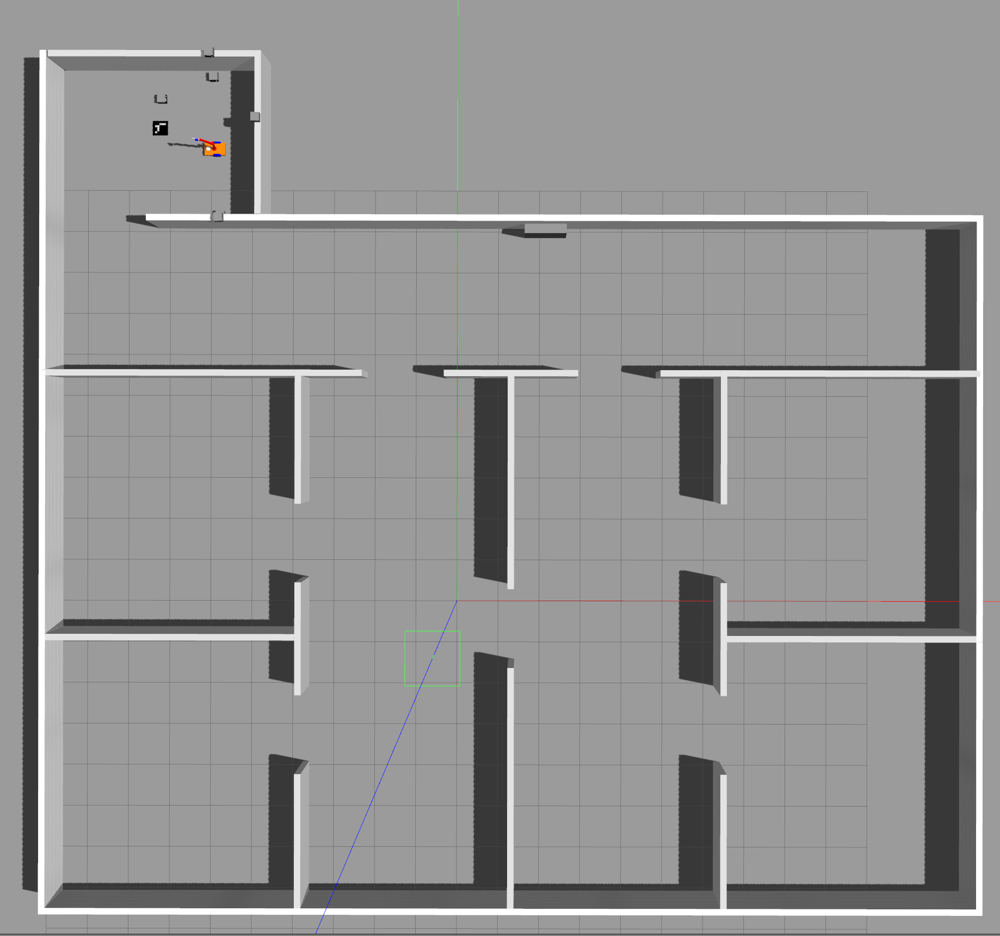
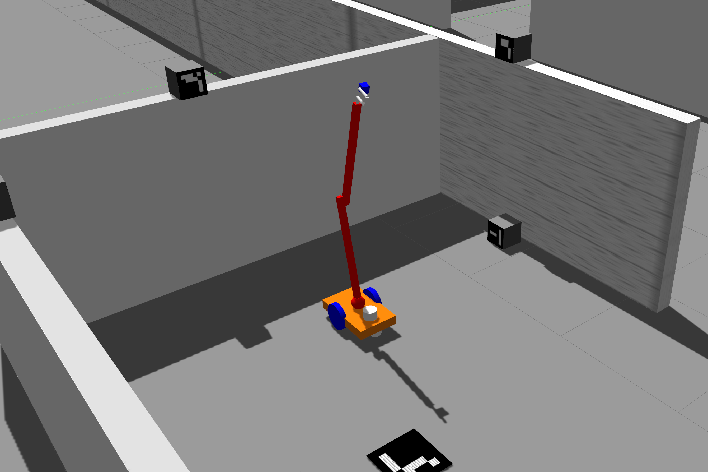

Simulation Environment
========================
The simulation software in this package is gazebo. The environment in which the robot should implement the 
scanning and patrolling behaviors, is shown in the following figures:

  