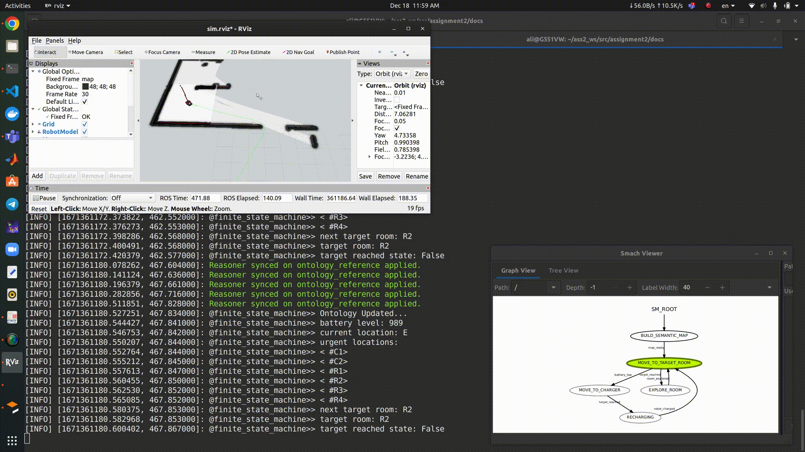
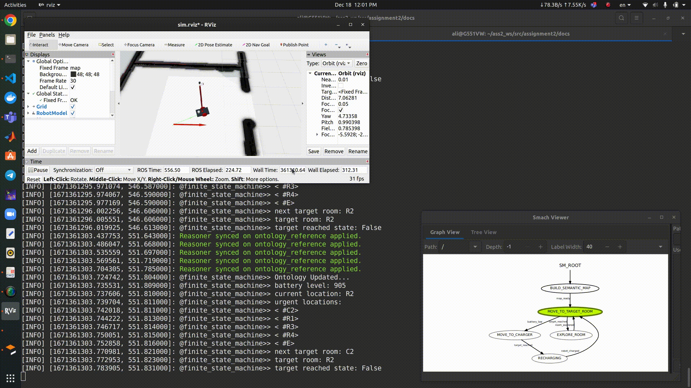
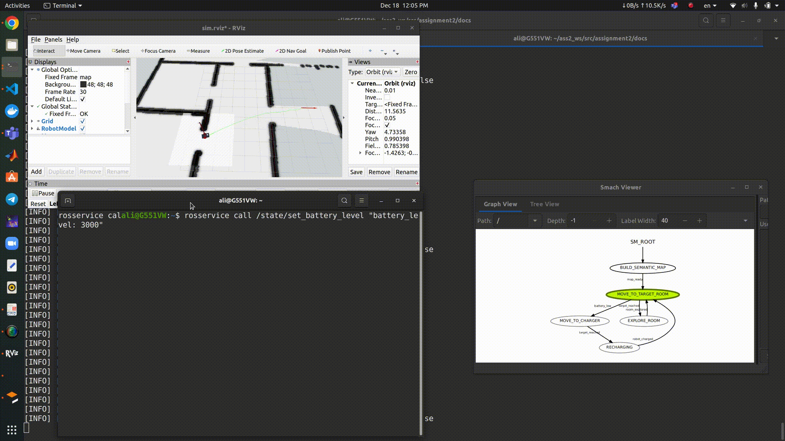

Usage
=====

Installation
------------
* This package is based on `aRMOR <https://github.com/EmaroLab/armor>`_, it has to be installed as it is described in the provided link as a pre-condition for running this package. 

* It is also depended on `smach <http://wiki.ros.org/smach>`_, it can be installed using the following commands:

.. code-block:: console

   $ sudo apt-get install ros-<distro>-executive-smach*
   $ sudo apt-get install ros-<distro>-smach-viewer

* For image processing part, the `aruco_ros <https://github.com/CarmineD8/aruco_ros>`_ and `cv_bridge <http://wiki.ros.org/cv_bridge>`_ packages have to be cloned and setup.

* Regarding the navigation part, `slam_gmapping <http://wiki.ros.org/slam_gmapping>`_  and `move_base <http://wiki.ros.org/move_base>`_ have to be installed .

* Finally, the `MoveIt <https://moveit.ros.org/>`_ package has to be installed for robot joints trajectory planning and control.

Once the dependencies are met, the package can be installed as it follows:

.. code-block:: console

   $ mkdir -p catkin_ws/src
   $ cd catkin_ws/src
   $ git clone https://github.com/aliy98/ros-moveit-opencv-ontology
   $ cd ..
   $ source /opt/ros/<distro>/setup.bash
   $ catkin_make

Running
--------

In order to initialize the software architucture along with simulation environment use the following commands:

.. code-block:: console

   $ source devel/setup.bash
   $ roslaunch assignment2 assignment.launch

Then, in another terminal, initialize ``finite_state_machine`` node using this command:

.. code-block:: console

   $ rosrun assignment2 finite_state_machine.py

Here is the result for the first state while the robot scans the markers:

.. image:: diagrams/build_map.gif
  :width: 800
  :align: center
  :alt: result

Once the robot builds the semantic map, it would move to target room as it is shown below:

When it reaches the target, the state will change to explore room:

While the robot moves to target, if the battery gets lower than threshold, it will move to charger:

  